# AWS Infrastructure Documentation

## Overview
PollPulse is deployed on AWS using the following services:
- **EC2**: t4.micro instance running Ubuntu 22.04
- **RDS**: MySQL 8.0 database (db.t3.micro)
- **VPC**: Custom VPC with public/private subnets
- **Elastic IP**: Static IP for consistent access

---

## 1. VPC Configuration

### VPC Details
- **VPC ID**: vpc-0990c742ca1a47149
- **CIDR Block**: 10.0.0.0/16
- **Region**: us-east-1

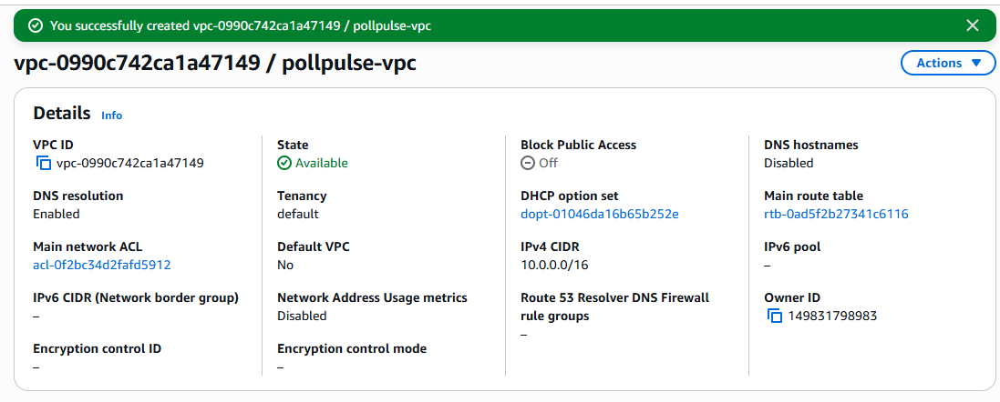
*Figure 1: VPC configuration showing CIDR block and subnets*

### Subnets

#### Public Subnet
- **Subnet ID**: subnet-09e777e7a26306bb4
- **CIDR**: 10.0.0.0/24
- **Availability Zone**: us-east-1a
- **Purpose**: Hosts EC2 instance

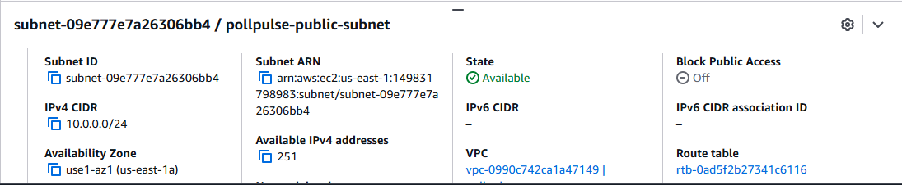
*Figure 2: Public subnet configuration*

#### Private Subnet 1
- **Subnet ID**: subnet-08c1a59ae71215efc
- **CIDR**: 10.0.1.0/24
- **AZ**: us-east-1a
- **Purpose**: RDS database

#### Private Subnet 2
- **Subnet ID**: subnet-0c50057bce81cb7f2
- **CIDR**: 10.0.2.0/24
- **AZ**: us-east-1b
- **Purpose**: RDS multi-AZ backup

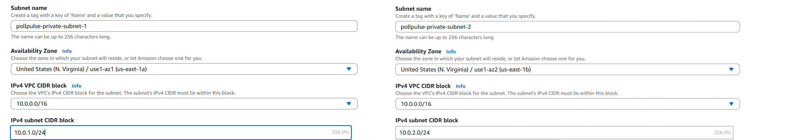
*Figure 3: Private subnets for database isolation*

### Internet Gateway
- **IGW ID**: igw-0bd5faa3fcbd55cb3
- **Attached to**: vpc-0990c742ca1a47149

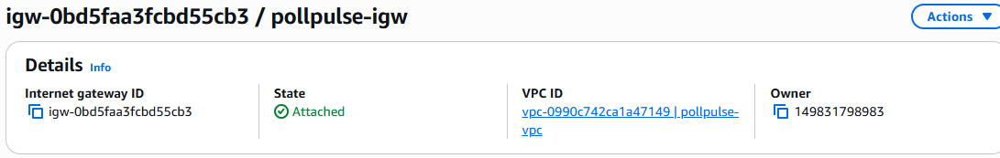
*Figure 4: Internet Gateway attached to VPC*

---

## 2. EC2 Instance

### Instance Details
- **Instance ID**: i-032d246a7913744bd
- **Type**: t4.micro (1 vCPU, 1 GB RAM)
- **AMI**: Ubuntu Server 22.04 LTS
- **Public IP**: 35.153.39.217
- **Elastic IP**: 44.211.7.10
- **Private IP**: 10.0.0.71

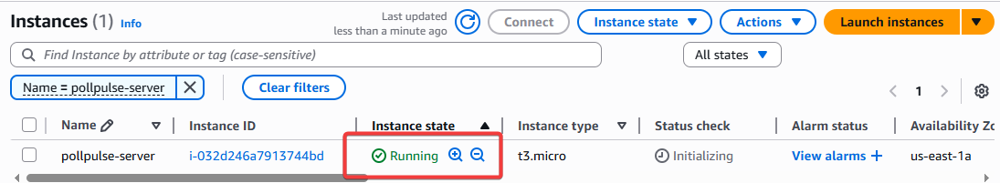
*Figure 5: EC2 instance running in public subnet*

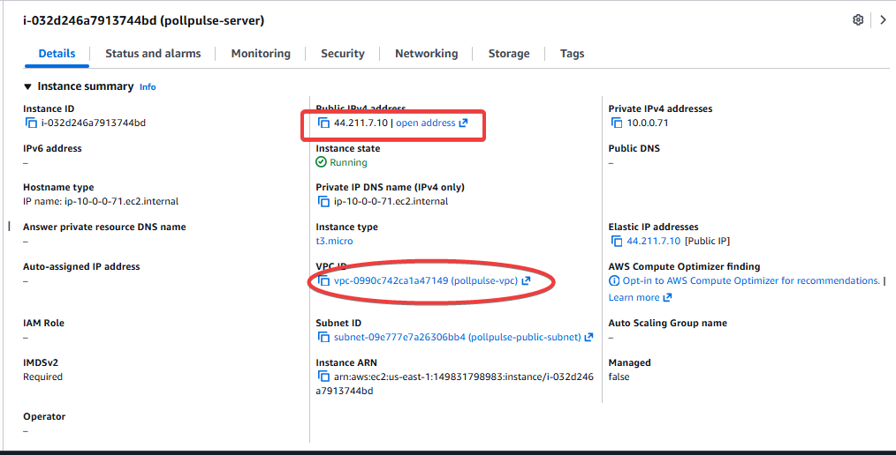
*Figure 6: EC2 instance specifications*

### Security Group Configuration
- **Security Group ID**: sg-xxxxx
- **Inbound Rules**:
  - SSH (22): My IP only
  - HTTP (80): 0.0.0.0/0
  - HTTPS (443): 0.0.0.0/0
  - Custom TCP (3000): 0.0.0.0/0

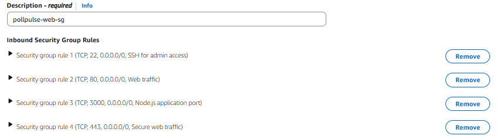
*Figure 7: EC2 security group rules*

### Elastic IP
- **Allocation ID**: eipalloc-xxxxx
- **IP Address**: 44.211.7.10
- **Associated with**: i-032d246a7913744bd

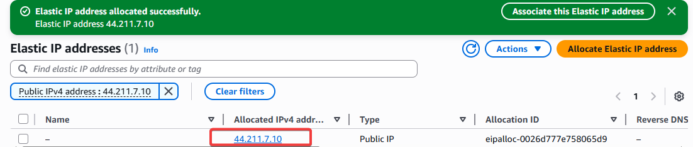
*Figure 8: Elastic IP configuration for persistent access*

---

## 3. RDS Database

### Database Details
- **DB Instance ID**: pollpulse-db
- **Engine**: MySQL 8.0.44
- **Instance Class**: db.t3.micro
- **Storage**: 20 GB SSD
- **Endpoint**: pollpulse-db.c6neuowq6ifc.us-east-1.rds.amazonaws.com
- **Port**: 3306

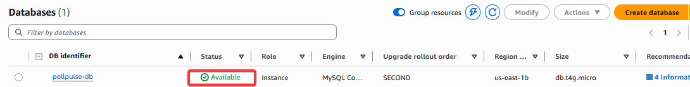
*Figure 9: RDS MySQL instance configuration*

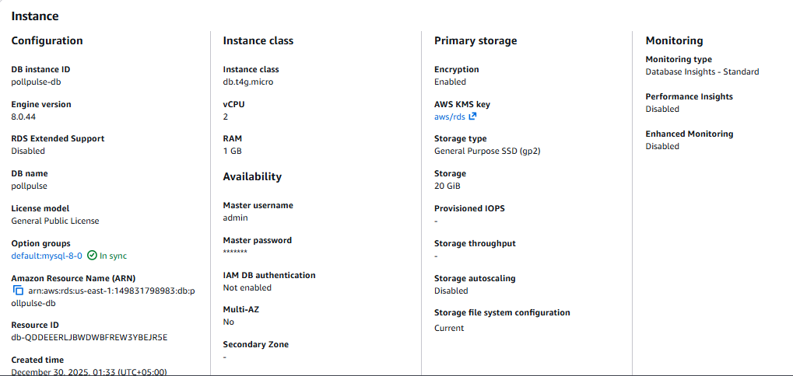
*Figure 10: Database specifications and connectivity*

### Database Configuration
- **DB Name**: pollpulse
- **Master Username**: admin
- **Multi-AZ**: No (single AZ for free tier)
- **Public Access**: No (private subnet only)
- **Backup Retention**: 7 days
- **Automated Backups**: Enabled


### Security Group
- **Inbound Rules**:
  - MySQL (3306): EC2 security group only

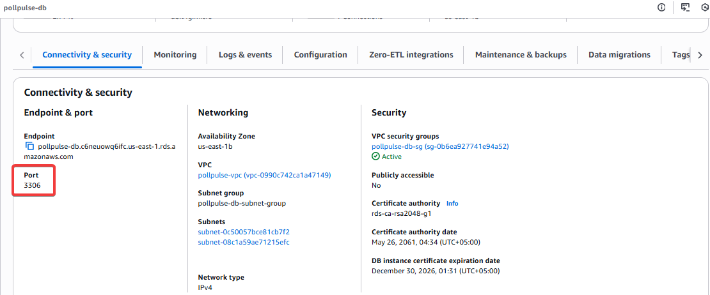
*Figure 12: RDS security group restricting access to EC2*

---

## 4. Network Architecture
```
Internet
    ↓
Internet Gateway (igw-0bd5faa3fcbd55cb3)
    ↓
VPC (10.0.0.0/16)
    ↓
    ├── Public Subnet (10.0.0.0/24)
    │   └── EC2 Instance (10.0.0.71)
    │       - Elastic IP: 44.211.7.10
    │       - Node.js Application
    │
    └── Private Subnets
        ├── 10.0.1.0/24 (us-east-1a)
        └── 10.0.2.0/24 (us-east-1b)
            └── RDS MySQL Database
                - No public access
                - Accessible only from EC2
```


*Figure 13: Complete network architecture*

---

## 5. Cost Analysis

### Monthly Estimates (Free Tier)
- **EC2 t2.micro**: $0.00 (750 hours/month free)
- **RDS db.t3.micro**: $0.00 (750 hours/month free)
- **EBS Storage**: $0.00 (30 GB free)
- **Data Transfer**: $0.00 (15 GB outbound free)
- **Elastic IP**: $0.00 (while associated)

**Total Monthly Cost**: $0.00 (within free tier limits)


*Figure 13: AWS cost dashboard showing free tier usage*

---


## 7. Backup Strategy

### RDS Automated Backups
- Daily automatic backups at 3:00 AM UTC
- 7-day retention period
- Point-in-time recovery enabled

### Application Backups
- Daily PM2 save: `pm2 save`
- Weekly full backup: `~/pollpulse/backups/`

---

## Security Best Practices Implemented

✅ **Network Security**
- Private subnets for database
- Security groups with least privilege
- No direct internet access to RDS

✅ **Access Control**
- SSH key-based authentication
- Admin password-protected dashboard
- Session-based authentication

✅ **Data Security**
- MySQL encrypted at rest
- SSL/TLS for data in transit
- Environment variables for secrets

✅ **Monitoring**
- CloudWatch alarms for CPU > 80%
- PM2 process monitoring
- Application error logging

---

## Conclusion

This infrastructure provides a scalable, secure, and cost-effective deployment for PollPulse while remaining within AWS Free Tier limits.
